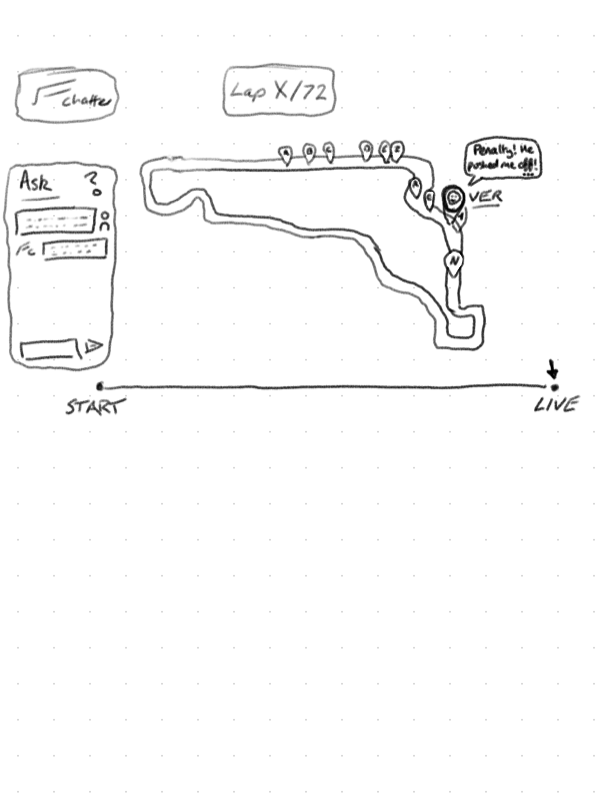

# App Idea

I want to create a web app that allows me to listen to the radio chatter from the
Formula 1 drivers and race engineers during a session. It will have a live interface,
a "track map" showing the current position of the drivers, where chat messages pop up as
they happen. Only the most interesting messages will be shown.

## Name

F1 Chatter

## Features

### Live Interface

- Live interface showing the current information
- "Track map" showing the current position of the drivers
- Drivers have a minimum horizontal spacing on the track map, to avoid clutter. They
overlap nicely vertically, with highlighted drivers always on-top, and otherwise,
drivers ahead on-top.
- Highlight chat messages pop up as they happen
- Highlighted messages get added to a scrollable log at the bottom as soon as they
appear, and build up over time.
- The driver with the current highlighted message has extra emphasis on the track map
- The driver with the current highlighted message has their full info showing in a box
top right of the screen
- Only the most interesting messages will be shown, filtered messages by AI
- Race control messages can show up as popups
- At the top of the screen, relative session time shows (CURRENT / FINAL). For example,
halfway through a race, it might show as (1:02:42 / 1:58:00)

### Time Management

- Users first hit a home screen, which shows a list of all the sessions available,
and a button to "start" a session. It scrubs to "LIVE" by default, unless the session
has ended, in which case it scrubs to "START".
- Along the bottom of the screen, a "START" to "LIVE" timeline scrubber, alows the user
to scrub through the session, and see the messages at different points in time.
- The app should be able to run locally with a single startup script
- State is carefully managed by timestamp, so that the frontend can show the correct
information at any given time, but also so that API usage is efficient, and so multiple
frontend instances can be used to show the same information to multiple users, all using
one backend instance.
- During a live session, the backend "polls" for the latest messages and data, once
every 30 seconds.

### AI Chat Sidepanel

This is an extension feature, which won't be there for MVP.

- Side panel which allows the user to chat with an AI, which has access to all the
messages of the current session.
- 2x Example messages are shown, which the user can click to select as a starting point
for their chat.

## Tech Stack

- Python Django Backend
  - Local sqlite database
  - Django Ninja to define, document and serve the API
  - Custom management commands to populate the database with data from the OpenF1 API
  and Discord Message Fetcher
- Svelte Frontend
- OpenF1 API (data source for extra information like driver info, track info, session
  times, etc.)
- Discord Message Fetcher (to get the radio messages from the Discord channel)

### Running the app (locally deployed)

The app is run via a start.sh bash script. It checks and installs if dependancies
are missing. The exception to this is uv (python), which is a required prerequisite.

## Development Flow

### Phase 1: Sessions

1. A management command that populates our database with all session info from OpenF1,
as per the next part.
2. A Django Ninja endpoint that, to an API user, lists all the current year's (season's)
available sessions. It must include start and end time of a session, and a session_id
which is unique to the session.

### Phase 2: Messages

1. Start by getting the discord message fetcher working. It needs to use the
DiscordChatExporter CLI, to fetch JSON data and save locally, either for a session by
session_id, or for a time period by start and end timestamps (iso format).
2. Then once figured that out, add a custom django management command that has a select
few parameters, to make it easy to fetch and update the database with the latest
messages. This will need to custom parse and ingest the JSON data.
3. Add in to the start script the automation of this, running it once every 30 seconds
in an endless loop, with error handling so it never brings the whole stack down.
4. Then add an endpoint for latest_state, that allows a future frontend to get the data
it needs for the most recent 30 second period. It would return the `highlight_message`
so the frontend knows which driver on track to show a message against. The highlight
message at this stage of development (no AI) is just the most recent message.
5. Build the most basic frontend possible. Drivers don't move and are at mocked static
locations. The driver info like name, abbreviation, icon, is all hardcoded. The session
is hardcoded to be simply the latest session. The only interactive element is the fact
that latest_state is being polled, and when it chanes its response, the frontend nicely
highlights the new highlight messsage and driver.

### Phase 3: Enriching with real data fetched live from OpenF1

- Driver info isn't hardcoded into the frontend.
- Instead of icon, when a driver is highlighted, their headshot shows.

### Phase 4: AI

- Filtering of the messages so the highlight message for a time period is actually the
most interesting.
- Sentiment analysis on each message, so a happy/neutral/sad face emoji can show next
to the message.
